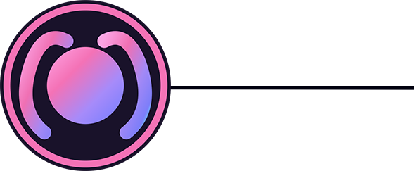

# NogoChain Explorer - Complete Documentation

<div align="center">



[](https://github.com/nogochain/nogo-explorer/actions/workflows/lint.yml)
[](https://www.typescriptlang.org/)
[](https://www.mongodb.com/)
[](https://nodejs.org/)
[](https://nextjs.org/)
[](https://opensource.org/licenses/MIT)

**NogoChain Blockchain Explorer | Modern, Real-time, Full-featured**

[中文版](README-ZH.md) | [Deployment Guide](DEPLOYMENT.md) | [Quick Start](QUICKSTART.md)

</div>

---

## 📖 Table of Contents

- [Introduction](#introduction)
- [Key Features](#key-features)
- [DEX Features](#dex-features)
- [Tech Stack](#tech-stack)
- [System Requirements](#system-requirements)
- [Quick Start](#quick-start)
- [Deployment Guide](#deployment-guide)
- [Configuration](#configuration)
- [API Documentation](#api-documentation)
- [Development Guide](#development-guide)
- [Troubleshooting](#troubleshooting)
- [Contributing](#contributing)
- [License](#license)

---

## Introduction

NogoChain Explorer is a modern, full-featured blockchain explorer built for the NogoChain network. Built with Next.js 15 App Router, TypeScript, and MongoDB, it supports advanced NFT browsing, contract verification, comprehensive token analytics, built-in DEX, and token launchpad.

**Design Goals**:
- 🚀 High-performance, scalable architecture
- 📱 Mobile-first responsive design
- 🔍 Powerful search and analytics
- 💎 Complete NFT and token support
- 💱 Built-in decentralized exchange
- 🎨 No-code token creation platform

---

## Key Features

### 🔍 Advanced Search
- Search blocks, transactions, addresses, and contracts
- Intelligent filtering and sorting
- Address labeling and notes system
- Search history tracking

### 💎 NFT Explorer
- Full ERC-721 and ERC-1155 support
- NFT metadata parsing and display
- Image galleries and collection analytics
- Rarity scoring and statistics

### 📊 Real-time Analytics
- Network statistics and performance metrics
- Gas price tracking and prediction
- Transaction volume and activity analysis
- Blockchain health monitoring

### 🛡️ Contract Verification
- Solidity compiler integration
- Multi-file contract verification
- Constructor arguments parsing
- Open source license identification

### 💰 Token Management
- ERC-20/721/1155 comprehensive support
- Holder analysis and distribution charts
- Token price and market cap tracking
- Social media links integration

### 📈 Rich List
- Real-time account balance rankings
- Wealth distribution analysis
- Large transaction monitoring
- Address labeling system

### 💸 Price Tracking
- CoinGecko API integration
- CoinPaprika API integration
- Multi-exchange price aggregation
- Historical price charts

### ⚡ Real-time Sync
- WebSocket real-time updates
- Automatic block height synchronization
- Transaction pool monitoring
- Event subscription system

### 🔄 DEX (Decentralized Exchange)
- Token swap functionality
- Liquidity pool management
- Yield farming
- Trading charts and candlesticks

### 🎨 Token Launchpad V2
- No-code token creation
- Metadata configuration
- Transfer, approve, burn functions
- Automatic contract verification

---

## DEX Features

Built-in decentralized exchange providing complete DeFi functionality:

### Token Swap
- ✅ Automatic price calculation
- ✅ Slippage tolerance configuration
- ✅ Price impact warnings
- ✅ Multi-path routing optimization
- ✅ Transaction deadline protection

### Liquidity Pools
- ✅ Add/remove liquidity
- ✅ LP token management
- ✅ Real-time pool statistics
- ✅ Trading fee distribution
- ✅ Liquidity share tracking

### Yield Farming
- ✅ Stake LP tokens
- ✅ Earn NOGOG rewards
- ✅ Real-time APY calculation
- ✅ Reward compounding options
- ✅ Farming history queries

### Trading Charts
- ✅ Real-time price charts
- ✅ Candlestick charts support
- ✅ Trading volume statistics
- ✅ Depth chart display

---

## Tech Stack

### Frontend
- **Next.js 16** - React full-stack framework (App Router)
- **React 19** - UI framework
- **TypeScript 5** - Type safety
- **Tailwind CSS** - Styling system
- **Wagmi + Viem** - Web3 React Hooks
- **Heroicons** - Icon library

### Backend
- **Next.js API Routes** - Server-side API
- **MongoDB** - Database
- **Mongoose** - ODM library
- **Ethers.js v6** - Web3 library
- **Web3.js** - Alternative Web3 library

### Development Tools
- **ESLint** - Code linting
- **Prettier** - Code formatting
- **Jest** - Testing framework
- **PM2** - Process management
- **Docker** - Containerization

### Infrastructure
- **Node.js 24+** - Runtime environment
- **Nginx** - Reverse proxy
- **Let's Encrypt** - SSL certificates
- **GitHub Actions** - CI/CD

---

## System Requirements

### Minimum Configuration
| Component | Requirements |
|-----------|-------------|
| CPU | 2 cores |
| RAM | 2GB |
| Storage | 20GB available space |
| OS | Ubuntu 20.04+ / CentOS 7+ |

### Recommended Configuration
| Component | Requirements |
|-----------|-------------|
| CPU | 4 cores |
| RAM | 4GB |
| Storage | 50GB SSD |
| OS | Ubuntu 22.04 LTS |

### Dependencies
- **Node.js**: 18.x or higher
- **npm**: 8.x or higher
- **MongoDB**: 6.0 or higher
- **PM2**: Latest stable version

---

## Quick Start

### 1. Install Dependencies

```bash
# Clone repository
git clone https://github.com/nogochain/nogo-explorer.git
cd nogo-explorer

# Install dependencies
npm install
```

### 2. Configuration File

```bash
# Copy configuration example
cp config.example.json config.json

# Edit configuration
vim config.json
```

**Key Configuration**:
```json
{
  "nodeAddr": "localhost",
  "port": 8545,
  "currency": {
    "symbol": "NOGO",
    "name": "NogoChain",
    "decimals": 18
  },
  "dex": {
    "enabled": true,
    "router": "0x...",
    "factory": "0x..."
  }
}
```

### 3. Configure MongoDB

```bash
# Start MongoDB
sudo systemctl start mongod

# Create database
mongosh
> use nogo-explorer
> db.createUser({
    user: "explorer",
    pwd: "password",
    roles: ["readWrite"]
  })
```

### 4. Start Services

```bash
# Development mode
npm run dev

# Production build
npm run build
npm run start

# Using PM2
pm2 start npm --name "nogo-explorer" -- start
```

---

## Deployment Guide

### Method 1: Manual Deployment

For detailed steps, please refer to [Deployment Guide](DEPLOYMENT.md)

### Method 2: Docker Deployment

```bash
# Build image
docker-compose build

# Start services
docker-compose up -d

# View logs
docker-compose logs -f
```

### Method 3: Script Deployment

```bash
# One-click deployment script
chmod +x deploy.sh
./deploy.sh
```

---

## Configuration

### Database Configuration

```json
{
  "mongoUri": "mongodb://localhost:27017/nogo-explorer",
  "mongoOptions": {
    "useNewUrlParser": true,
    "useUnifiedTopology": true
  }
}
```

### RPC Node Configuration

```json
{
  "nodeAddr": "localhost",
  "port": 8545,
  "wsPort": 8546,
  "protocol": "http"
}
```

### DEX Configuration

```json
{
  "dex": {
    "enabled": true,
    "router": "0xRouterAddress",
    "factory": "0xFactoryAddress",
    "wrappedNative": {
      "address": "0xWNOGO",
      "name": "Wrapped NogoChain",
      "symbol": "WNOGO"
    },
    "rewardToken": {
      "address": "0xNOGOG",
      "name": "NogoChain Gold",
      "symbol": "NOGOG"
    }
  }
}
```

### Sync Configuration

```json
{
  "bulkSize": 100,
  "syncAll": true,
  "startBlock": 0,
  "endBlock": null,
  "maxRetries": 3,
  "retryDelay": 1000
}
```

---

## API Documentation

### Public API

#### Get Block Information
```bash
GET /api/block/[number]
```

#### Get Transaction Details
```bash
GET /api/tx/[hash]
```

#### Get Address Information
```bash
GET /api/address/[address]
```

#### Get Token Information
```bash
GET /api/tokens/[address]
```

### DEX API

#### Get Trading Pairs List
```bash
GET /api/dex/pairs
```

#### Get Tokens List
```bash
GET /api/dex/tokens
```

#### Get Candlestick Data
```bash
GET /api/dex/chart/[pair]
```

### CMC API

#### Asset Allocation
```bash
GET /api/dex/cmc/assets
```

#### Pair Summary
```bash
GET /api/dex/cmc/summary
```

#### Real-time Price
```bash
GET /api/dex/cmc/ticker
```

For complete API documentation, please visit `/api-docs`

---

## Development Guide

### Project Structure

```
nogo-explorer/
├── app/                    # Next.js App Router pages
│   ├── api/               # API routes
│   ├── dex/               # DEX related pages
│   ├── launchpad/         # Launchpad pages
│   └── ...
├── components/            # React components
├── config/                # Configuration files
├── hooks/                 # React Hooks
├── lib/                   # Utility libraries
├── models/                # MongoDB models
├── tools/                 # Utility scripts
└── types/                 # TypeScript types
```

### Add New Page

```bash
# Create new page
touch app/my-page/page.tsx
```

```typescript
export default function MyPage() {
  return (
    <div>
      <h1>My Page</h1>
    </div>
  )
}
```

### Add API Endpoint

```bash
# Create new API
touch app/api/my-api/route.ts
```

```typescript
import { NextResponse } from 'next/server'

export async function GET() {
  return NextResponse.json({ data: 'test' })
}
```

### Code Standards

```bash
# Code linting
npm run lint

# Code formatting
npm run format
```

---

## Troubleshooting

### Common Issues

#### 1. npm install Fails

**Problem**: Dependency installation fails
**Solution**:
```bash
npm install --legacy-peer-deps
# or
rm -rf node_modules package-lock.json
npm install
```

#### 2. MongoDB Connection Fails

**Problem**: Cannot connect to MongoDB
**Solution**:
```bash
# Check MongoDB status
sudo systemctl status mongod

# Restart MongoDB
sudo systemctl restart mongod
```

#### 3. Sync Script Stuck

**Problem**: Block sync stops
**Solution**:
```bash
# View logs
pm2 logs sync

# Restart sync service
pm2 restart sync
```

#### 4. DEX Transaction Fails

**Problem**: Swap or add liquidity fails
**Solution**:
- Check contract address configuration
- Confirm wallet is connected
- Check Gas settings
- View browser console errors

### Log Viewing

```bash
# Web service logs
pm2 logs nogo-explorer

# Sync service logs
pm2 logs sync

# Database logs
sudo tail -f /var/log/mongodb/mongod.log
```

---

## Contributing

### Submit Code

1. Fork the project
2. Create feature branch (`git checkout -b feature/AmazingFeature`)
3. Commit changes (`git commit -m 'Add some AmazingFeature'`)
4. Push to branch (`git push origin feature/AmazingFeature`)
5. Open Pull Request

### Report Issues

Please report bugs and request features in GitHub Issues.

### Code Standards

- Follow ESLint configuration
- Use TypeScript strict mode
- Write unit tests
- Update documentation

---

## License

This project is licensed under the MIT License - see the [LICENSE](LICENSE) file for details.

---

## Contact

- **Website**: https://nogochain.org
- **Email**: support@nogochain.org
- **Twitter**: @NogoChain
- **Discord**: https://discord.gg/nogochain
- **Telegram**: https://t.me/nogochain

---

<div align="center">

**NogoChain Explorer** - Built for the NogoChain Ecosystem

Made with ❤️ by the NogoChain Team

[Back to Top](#nogochain-explorer---complete-documentation)

</div>
